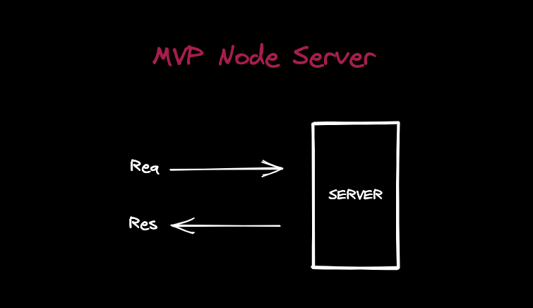

# T

### 01.背景

说来惭愧，自己从 18 年刚刚参加工作时接触的第一个 Node.js 框架就是 Express，后面慢慢用了 Koa2，Egg.js，Nest.js，但是基本上都停留在使用层面，从来没有想要过探索源码。大部分情况都是 CRUD，慢慢工作了 4 年了，确实是感觉，还这样下去不行。所以还是想着慢慢的学习源码。慢慢对自己 Node 基础缺失部分进行查漏补缺。


```sh
.
├── application.js
├── express.js
├── middleware
│   ├── init.js
│   └── query.js
├── request.js
├── response.js
├── router
│   ├── index.js
│   ├── layer.js
│   └── route.js
├── utils.js
└── view.js

2 directories, 11 files
```

如果你尝试拉取过源码你就会知道，其实 Express 的源码其实非常的少，很容易给你一种源码很简单的错觉。

> 至少最开始我自己看到的时候 觉得他很简单。


 所以我自己还是以学习优秀文章为主，如果硬要自己看 理解。可能会花不少时间。我自己主要学习的一篇文章是

- [Express 源码阅读](https://segmentfault.com/a/1190000011090124) 

这篇文章和市面上的文章角度不一样，从正常的角度一步一步的实现一个 Express，在这种过程中你会慢慢理解 Express 的构建过程。


至于其他的文章，大多都是一上来就开始总结，Express 有几个组成部分，可能还是我自己比较愚钝。不是很能理解到。本文也是基于[Express 源码阅读](https://segmentfault.com/a/1190000011090124) 的总结，加入一些我自己的理解。


### 02. 一个最简单的 Node 服务

我个人人为想要理解 Express 中运行原理非常重要的一步就是 理解 Node 如果创建一个 HTTP Server。
毕竟 Express 也就是在 Node Server 的基础之上做扩展。通过一些封装，让官方的 Server 变得更加的好用。


 在 Node 官网 HTTP 模块下有一个代码例子，通过几行代码就可以创建一个 Server

```js
const http = require('http');

// Create a local server to receive data from
const server = http.createServer((req, res) => {
  res.writeHead(200, { 'Content-Type': 'application/json' });
  res.end(JSON.stringify({
    data: 'Hello World!'
  }));
});

server.listen(8000);
```


通过 `node testServer.js` 运行 js 文件。


直接访问 8000 端口。就可以得到我们指定的信息了。


#### 03. 小小的拆分一下请求流程


官方提供的 Server Demo 算是提供一个非常基本的 Server，可以接受请求和响应. 

接下来我们尝试对其进行改造，完成一些我们的需求。在改造之前我们先看一下 Node 的官方文档，关于这里的 req，和 res 的描述。


通过文档我们可以知道 req 对象对应的是 IncomingMessage，res 对应的为 ServerResponse。


通过我们平常使用框架的经验，我们需要知道以下问题。

- HTTP 请求是分类型的，分别由 GET POST UPDATE PATCH DELETE OPTION ...
- 请求参数分为 url params, path params, content body
- 如何做 JWT 认证，好像是放在 Header 头里面的
- 服务器可以上传文件，也可以下载文件。
- Cookie Session 如何处理
- What is SSR?
- 中间件如何实现
